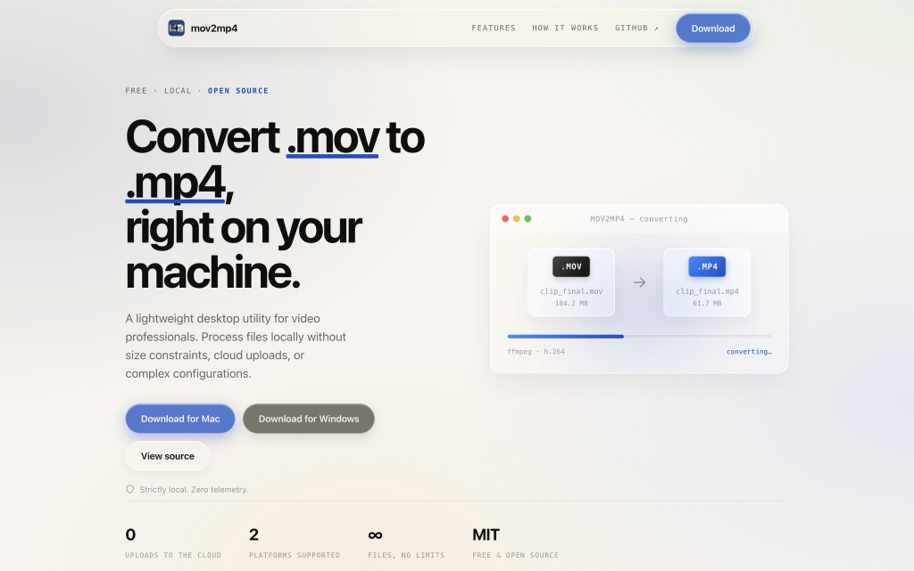

# MOV2MP4

Turn MOV files into MP4 locally on your Mac or Windows PC—fast, private, and simple.

Made for editors, creators, and anyone who wants their videos converted without dealing with file limits, cloud uploads, or complicated settings.



---

## Download

### Windows
[**Download MOV2MP4 for Windows (x64)**](https://github.com/MaybeSomeone-arc18/mov2mp4/releases/tag/v0.1.0-windows)  
*Works on Windows 10 and 11 (64-bit).*

### macOS
[**Download MOV2MP4 for Mac (Apple Silicon)**](https://github.com/MaybeSomeone-arc18/mov2mp4/releases/tag/v0.1.0-macos)  
*Works on Apple Silicon Macs: M1, M2, M3, M4 and newer.*

---

## First Time Setup

### Windows

You don't need to install Python, FFmpeg, or any development tools. Everything is bundled into a single installer.

1. **Download the installer** — Download `MOV2MP4-Setup.exe`.
2. **Run the installer** — Double-click `MOV2MP4-Setup.exe` and follow the steps.
3. **Open MOV2MP4** — Open MOV2MP4 from your Start Menu or Desktop shortcut.

**Note on Windows Security:** Because this app is new and unsigned, Windows SmartScreen might show a warning ("Unknown publisher"). To proceed, click **More info** and then click **Run anyway**. You only have to do this once.

---

### macOS

You don't need to install Python, FFmpeg, Homebrew, or any other tools. 

1. **Download and open the DMG** — Download `MOV2MP4-macOS-arm64.dmg` and double-click to open it.
2. **Move to Applications** — Drag the MOV2MP4 app into your Applications folder.
3. **Open MOV2MP4** — Go to Applications and double-click MOV2MP4.

**Note on macOS Security:** Because the app is not yet signed with an Apple Developer certificate, macOS may block it from opening the first time.
To fix this:
1. Open **System Settings** and go to **Privacy & Security**.
2. Scroll down until you see the message about MOV2MP4 being blocked.
3. Click **Open Anyway**, and then click **Open**.

If it still does not open, run the `Launch MOV2MP4.command` script included inside the DMG file to automatically bypass the restriction.

---

## Using MOV2MP4

Once the app opens:

1. **Add your videos** — Drag your `.mov` files or folders directly into the app. You can add multiple files at once.
2. **Choose the output folder** — Click **Browse Folder** to select where you want your converted videos saved.
3. **Convert** — Click **Start Conversion**.

Your files are processed directly on your computer. Nothing is ever uploaded to the cloud.

### Options
- **Batch conversion:** Convert queues of multiple videos at once.
- **Overwrite existing files:** Re-convert and overwrite existing MP4 files if needed.
- **Delete Original:** Automatically remove source MOV files after a successful conversion. (Be careful with this setting).
- **Cancel anytime:** Stop active conversions safely without corrupting files.

---

## For Developers

MOV2MP4 is built on a multithreaded Python conversion engine, powered by an embedded FFmpeg binary and a CustomTkinter graphical interface.

### Tech Stack
- **Language:** Python 3.11
- **GUI:** CustomTkinter
- **Conversion Engine:** FFmpeg (bundled)
- **Packaging:** PyInstaller (macOS), Inno Setup (Windows)
- **CI/CD:** GitHub Actions

### Local Setup & Testing

```bash
# Clone the repository
git clone https://github.com/MaybeSomeone-arc18/mov2mp4.git
cd mov2mp4

# Set up a virtual environment
python3 -m venv .venv
source .venv/bin/activate
pip install -r requirements.txt

# Run the command-line interface
python convert.py ./videos --output ./converted

# Run unit tests
python3 -m unittest discover tests

# Build the macOS application bundle
./build_macos.sh
```

[View the Source Code on GitHub](https://github.com/MaybeSomeone-arc18/mov2mp4)
